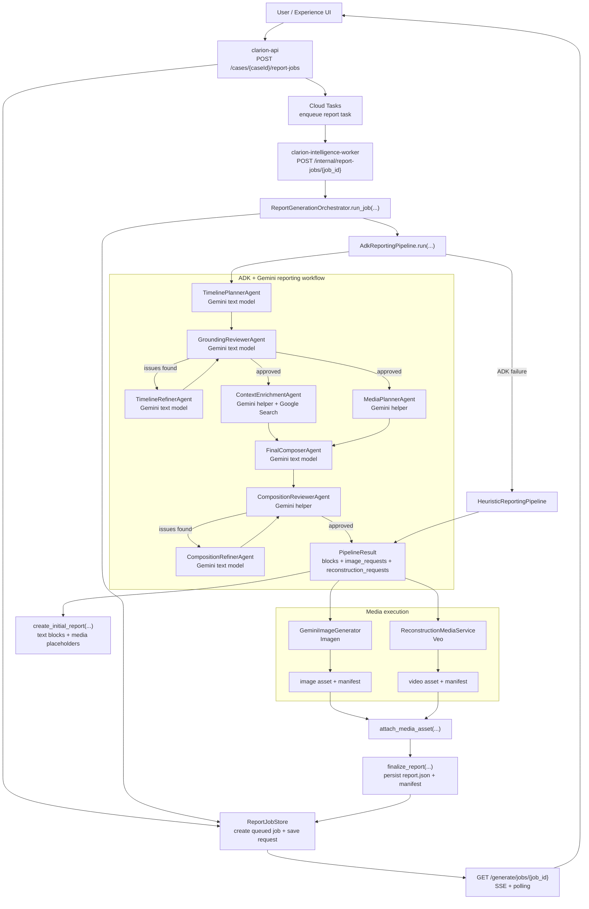

# Clarion

**Clarion** is an AI-powered litigation tool. It ingests case evidence such as PDFs, audio, images, and video, then:

1. **Indexes facts** - Builds citation-backed evidence references for specific claims.
2. **Finds contradictions** - Flags conflicts between sources like witness statements and official records.
3. **Generates reports** - Produces courtroom-ready reports that can include AI-generated images and reconstructions.

You create a case, upload evidence, analyze it, and generate a report through the API or the deployed web app. Clarion also includes a voice workflow for asking case questions and editing reports by speech.

---

## Quick Start

```bash
cd backend
pip install -r requirements.txt
cp .env.example .env
PYTHONPATH=. uvicorn app.main:app --reload
```

- API: `http://127.0.0.1:8000`
- Docs: `http://127.0.0.1:8000/docs`

---

## System Overview

Clarion currently runs as a small multi-service system on Google Cloud Run.

Core runtime pieces:

- **`clarion-experience`** - Next.js frontend for case intake, report viewing, and editing.
- **`clarion-api`** - Public FastAPI service. Handles uploads, case APIs, report/job APIs, exports, and voice endpoints.
- **`clarion-intelligence-worker`** - Private FastAPI worker service. Runs long-lived report generation and case analysis work.

Supporting infrastructure:

- **Cloud Tasks** - Queues report and analysis work for the worker service.
- **Firestore** - Persists case state, report jobs, workflow progress, and analysis metadata.
- **GCS** - Stores uploads, generated reports, media assets, and manifests.
- **Signed URL delivery** - The API converts private GCS artifact URIs into short-lived browser-safe URLs.
- **Optional reconstruction job path** - Reconstruction still has a separate Cloud Run Job path available when needed.

The backend codebase is deployed in different service modes:

- `CLARION_SERVICE_MODE=api` for `clarion-api`
- `CLARION_SERVICE_MODE=worker` for `clarion-intelligence-worker`

In API mode, the app exposes public routes like `/cases`, `/generate`, `/upload`, and `/voice`. In worker mode, it exposes only authenticated internal routes under `/internal/*`.

## Tech

- **Backend:** Python, FastAPI, Pydantic
- **Frontend:** Next.js
- **AI:** Google Gemini, Imagen, and Veo
- **Storage:** Firestore and GCS
- **Execution:** Cloud Tasks dispatches a warm Cloud Run worker service for report and analysis; reconstruction remains separate

## Google Cloud Deployment

### Current production shape

The active backend deployment is now **two Cloud Run services**, not one service plus report/analysis jobs:

- **`clarion-api`** - public backend service
- **`clarion-intelligence-worker`** - private backend worker service

Live services currently deployed in `us-central1`:

- `clarion-api`
- `clarion-intelligence-worker`
- `clarion-experience`

Cloud Run Jobs may still exist in the project:

- `clarion-report-worker`
- `clarion-analysis-worker`
- `clarion-reconstruction-worker`

Only the reconstruction job is still aligned with the active design. Report and analysis are now intended to run through the warm worker service.

### Config files

The repo already includes separate env files for the two backend services:

- [backend/cloudrun.env.yaml](/C:/Users/Larris/Documents/VSCodeFiles/clarion/backend/cloudrun.env.yaml) - API service config
- [backend/cloudrun.worker.env.yaml](/C:/Users/Larris/Documents/VSCodeFiles/clarion/backend/cloudrun.worker.env.yaml) - worker service config

Important settings:

- `CLARION_SERVICE_MODE=api` on the public API
- `CLARION_SERVICE_MODE=worker` on the worker service
- `INTELLIGENCE_WORKER_BASE_URL` on the API must point to the deployed worker service URL
- `INTELLIGENCE_WORKER_AUDIENCE` should usually match that same worker URL

### Async queues and worker endpoints

Clarion currently uses these queues:

- `clarion-report-jobs`
- `clarion-analysis-jobs`
- `clarion-reconstruction-jobs`

The main async path is:

- Report tasks call `POST /internal/report-jobs/{job_id}` on `clarion-intelligence-worker`
- Analysis tasks call `POST /internal/case-analysis/{case_id}` on `clarion-intelligence-worker`

Cloud Tasks should send OIDC tokens using the task-runner service account, and the worker service should grant that principal `roles/run.invoker`.

### Backend deploy flow

Deploy the worker service first:

```bash
cd backend

gcloud run deploy clarion-intelligence-worker \
  --source=. \
  --region=us-central1 \
  --service-account=clarion-runtime@YOUR_PROJECT.iam.gserviceaccount.com \
  --no-allow-unauthenticated \
  --concurrency=1 \
  --min-instances=1 \
  --timeout=1800 \
  --env-vars-file=cloudrun.worker.env.yaml
```

Then put the worker URL into `INTELLIGENCE_WORKER_BASE_URL` and `INTELLIGENCE_WORKER_AUDIENCE` inside [backend/cloudrun.env.yaml](/C:/Users/Larris/Documents/VSCodeFiles/clarion/backend/cloudrun.env.yaml), and deploy the API:

```bash
gcloud run deploy clarion-api \
  --source=. \
  --region=us-central1 \
  --service-account=clarion-runtime@YOUR_PROJECT.iam.gserviceaccount.com \
  --allow-unauthenticated \
  --min-instances=1 \
  --env-vars-file=cloudrun.env.yaml
```

The API and worker use the same source tree; only the env file and service mode differ.

## Report Workflow



## Private GCS Artifact Delivery

Cloud Run serves report and reconstruction artifacts from a private GCS bucket by generating V4 signed URLs at request time.

- Set `SIGNED_URL_SERVICE_ACCOUNT_EMAIL` to the service account that should sign artifact URLs.
- Enable `iamcredentials.googleapis.com` in the same project as the signer.
- Grant the API runtime service account `roles/iam.serviceAccountTokenCreator` on `SIGNED_URL_SERVICE_ACCOUNT_EMAIL`.
- Keep the bucket private. Clarion expects signed URLs instead of public `storage.googleapis.com` links.

Post-deploy validation:

1. Submit a reconstruction or report job until it reaches `completed`.
2. Call the polling or report endpoint and confirm the returned artifact URL is HTTPS and includes `X-Goog-Algorithm`, `X-Goog-Credential`, and `X-Goog-Signature`.
3. Fetch that URL from your browser or `curl` outside GCP and confirm the object loads without making the bucket public.

## Notes

- The checked-in Cloud Run env files currently contain a real Google API key value. That should be rotated and ideally moved into Secret Manager.
- For local configuration, start from [backend/.env.example](/C:/Users/Larris/Documents/VSCodeFiles/clarion/backend/.env.example).
- For deeper schema details, see `backend/app/models/schema.py` and `backend/app/models/report_schema.py`.
