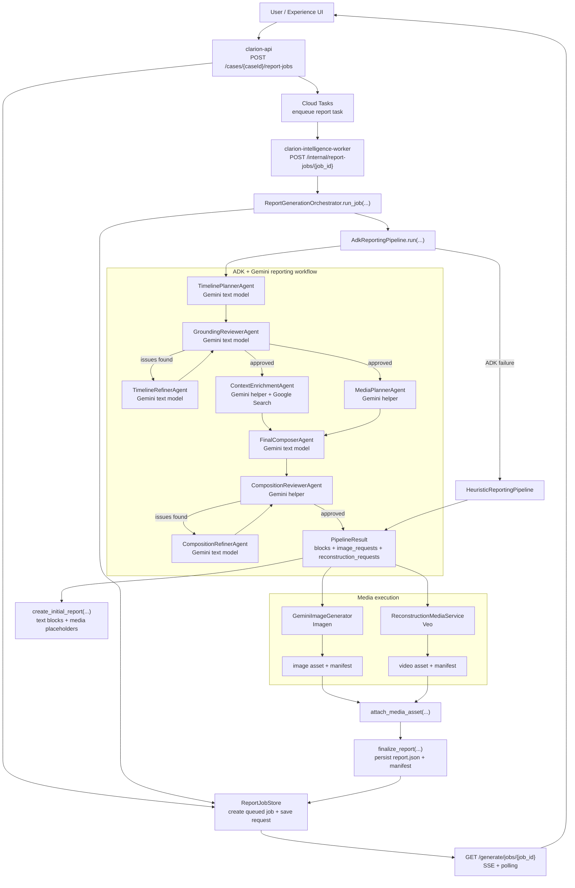

# Clarion

**Clarion** is an AI-powered litigation tool. It takes case evidence (PDFs, audio, images), parses and analyzes it, then:

1. **Indexes facts** — Builds a citation index so you can find and reference specific claims across documents.
2. **Finds contradictions** — Flags conflicting statements between sources (e.g. witness vs report).
3. **Generates reports** — Produces courtroom-ready reports you can stream, edit via chat, and export. Reports can include **AI-generated video** — scene reconstructions generated from witness descriptions (e.g. from testimony or statements), so you can present a visual version of the described events in court.

You create a case, upload evidence, and use the REST API (or future frontend) to generate reports, see contradictions, and include witness-based scene videos where needed. A **voice agent** (push-to-talk over WebSocket) lets you ask case questions and edit report sections via speech. Optional Google Gemini is used for summarization, analysis, and the voice agent; mocks are available for testing without an API key.

---

## Quick start

```bash
cd backend
pip install -r requirements.txt
cp .env.example .env   # fill in GCP / Firestore / Cloud Tasks / GCS settings
PYTHONPATH=. uvicorn app.main:app --reload
```

- API: **http://127.0.0.1:8000**  
- Docs: **http://127.0.0.1:8000/docs**

---

## Tech

- **Backend:** Python, FastAPI, Pydantic  
- **AI:** Google Gemini (optional)  
- **Storage:** Firestore for job metadata, GCS for report artifacts and job payloads
- **Execution:** Cloud Tasks dispatches a warm Cloud Run worker service for report and analysis; reconstruction remains on a separate Cloud Run Job

## Report Workflow



## Private GCS artifact delivery

Cloud Run serves report and reconstruction artifacts from a private GCS bucket by
generating V4 signed URLs at request time.

- Set `SIGNED_URL_SERVICE_ACCOUNT_EMAIL` to the service account that should sign artifact URLs.
- Enable `iamcredentials.googleapis.com` in the same project as the signer.
- Grant the API runtime service account `roles/iam.serviceAccountTokenCreator` on `SIGNED_URL_SERVICE_ACCOUNT_EMAIL`.
- Keep the bucket private. Clarion now expects signed URLs instead of public `storage.googleapis.com` links.

Post-deploy validation:

1. Submit a reconstruction or report job until it reaches `completed`.
2. Call the polling/report endpoint and confirm the returned artifact URL is HTTPS and includes `X-Goog-Algorithm`, `X-Goog-Credential`, and `X-Goog-Signature`.
3. Fetch that URL from your browser or `curl` outside GCP and confirm the object loads without making the bucket public.

For full API reference, project structure, and schema details, see the in-repo docs or `backend/app/models/schema.py`.
